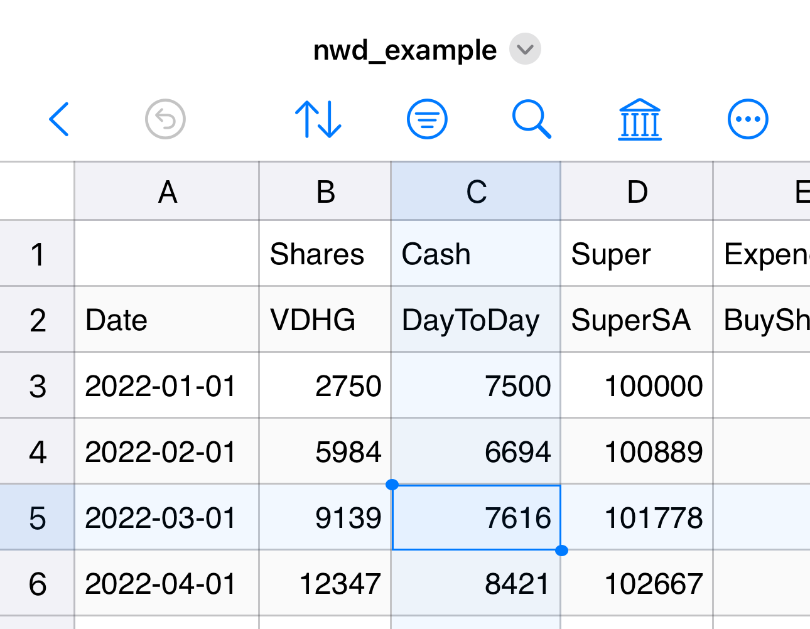

# Net worth dashboard CSV description

All of the data displayed on the dashboard is sourced from a single CSV file:

There are several features to this CSV file.

## Standard headers

There are __two rows__ of headers in this CSV file. The first row is the category of each column:

* `Cash`
    * _Liquid assets, possibly including day-to-day accounts as well as high-interest or term deposits_
* `Super` 
    * _Current value of retirement fund(s)_
* `Shares`
    * _Current value of investments in shares/stocks/ETFs/etc._
* `Expend`
    * _Once off expenditure of share investments. This allows the tracking your total profit/loss of your share portfolio_
* `Income`
    * _Once off income (pay/rent earned/interest/dividends)_

As these are controlled labels, they must match exactly the strings above or the column will be ignored (which can be useful to add extra "comment" columns if desired).
These labels are called the "column category".

The second row is the "column name". One of the columns *must* have column name of `Date` with entries by default in format `YYYY/MM/DD` (this date format is intepreted by Python's `datetime` module and can be customised as desired using parameter `datefmt` — strongly recommend a format which can be automatically sorted in your CSV editor).

All other column names are free text so you can label the columns to match your circumstances (e.g., the name of the bank or super account).
You can have as many or as few columns in each category as you like; they will be aggregated automatically to form the totals displayed in the dashboard.

## Structure of entries

Not all entries are expected to be filled in for every row. Cash, Super, and Shares — all the columns capturing the "current value" of your investments — must be entered collectively on a single date so that snapshot totals can be calculated.
Typically you would enter these only after an income event — e.g., fortnightly or monthly.

Because certain calculations are performed based on the first and last total entry in a year, it is a good idea to also add an entry for Jan 1 and Dec 31 even if they fall outside your standard cycle.

Expend and Income entries can be entered individually as they happen.

## Currency format

At time of writing, all amounts entered into the CSV file must be in integer dollar amounts.

## Renaming column categories

(Not yet implemented)

## Custom/linked headers

(Not yet implemented)