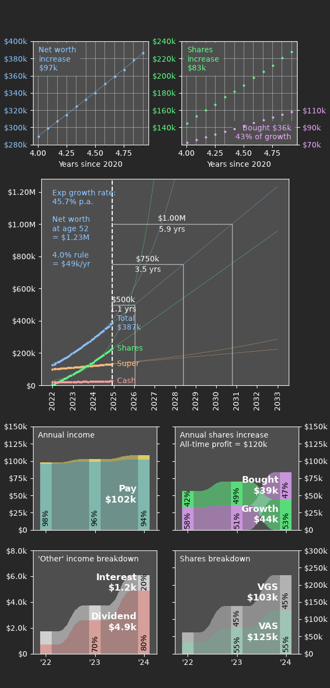

# Net worth dashboard Python package

## Introduction

### Quick links:

* [This page](https://wspr.io/networthdash/)
* [Code documentation](https://wspr.io/networthdash/reference/)
* [Github repository](https://github.com/wspr/networthdash)
* [ausankey package (dependency)](https://aumag.github.io/ausankey/)

### Example

A driver file can be as simple as:
```
import networthdash as nwd
cfg = nwd.Config(
    csv = "nwd_example.csv" ,
    datefmt = "%Y-%m-%d",
    born_yr = 1981 ,
    retire_age = 67 ,
)
nwd.dashboard(cfg)
```

With a CSV data file which looks like:
```
    ,      Shares, Cash,  Super,     Expend,Income,Income,  Income
Date,        VDHG,Daily,SuperSA,BuyShares,   Pay, Dividend,Interest
2022-01-01,  2750, 7500, 100000,      2750,  8000,        ,     375
2022-02-01,  5984, 6694, 100889,      2750,  8000,     138,     335
2022-03-01,  9139, 7616, 101778,      2750,  8000,        ,     381
...
2024-10-01,151402, 2972, 130223,      3250,  8500,        ,     149
2024-11-01,163005, 3326, 131167,      3250,  8500,    7570,     166
2024-12-01,167117, 3962, 132111,      3250,  8500,        ,     198
```
(you would create/edit this file in a CSV editor.)

This produces the following:



## Sell it to me

Once you start taking finances seriously, it becomes clear quickly that you need to keep track of certain things over time. The amount in your savings account from month to month. The income from stock market dividends. Growth of income from year to year.

If you're anything like me, you might have dabbled in a few ways to do this: a spreadsheet like Microsoft Excel, Apple Numbers, or Google Sheets; some other kind of proprietary app. For me, none of these options grabbed me. Vendor lock-in can be a long term problem, and data accessibility is important. Despite their increasing power, spreadsheets are still hard to create really top-notch dashboards in. Complex labelling and analysis is nigh impossible in a dynamic sense.

My solution is to keep all data that you want to track in a single CSV file. Yes, there are a lot of columns, but it is very easy to update and edit. Unlike a spreadsheet, there's no way to accidently break formulae by changing entries incorrectly, or adding rows/columns. The CSV data can be easily and robustly postprocessed into a dashboard, and the data remains available for other tools without need for exporting. This package uses matplotlib and ausankey to do this.

The long term intention is to provide a suite of customisations. For now much of the dashboard is hard-coded for my own needs.

## Environment

I use iOS to develop and use this code. I am unaffiliated with but recommend the following apps for doing so:

* [Pythonista](http://omz-software.com/pythonista/)
* [Easy CSV Editor](https://vdt-labs.com/easy-csv-editor/)