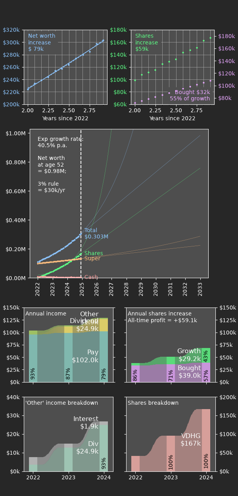

# Net worth dashboard Python package

## Introduction

Quick links:

* [This documentation](https://wspr.io/networthdash/)
* [Github repository](https://github.com/wspr/networthdash)
* [ausankey dependency](https://aumag.github.io/ausankey/)

## Example

## Sell it to me

Once you start taking finances seriously, it becomes clear quickly that you need to keep track of certain things over time. The amount in your savings account from month to month. The income from share market dividends. Growth of income from year to year.

If you're anything like me, you might have dabbled in a few ways to do this: a spreadsheet like Microsoft Excel, Apple Numbers, or Google Sheets; some other kind of proprietary app. For me, none of these options grabbed me. Vendor lock-in can be a long term problem, and data accessibility is important. Despite their increasing power, spreadsheets are still hard to create really top-notch dashboards in.

My solution is to keep all data that you want to track in a single CSV file. Yes, there are a lot of columns, but it is very easy to update and edit. Most importantly, CSV data can be easily postprocessed into a dashboard. This package uses matplotlib and ausankey to do this.

The long term intention is to provide a suite of customisations. For now much of the dashboard is hard-coded for my own needs.

## Environment

I use iOS to develop and use this code. I am unaffiliated with but recommend the following apps for doing so:

* [Pythonista](http://omz-software.com/pythonista/)
* [Easy CSV Editor](https://vdt-labs.com/easy-csv-editor/)